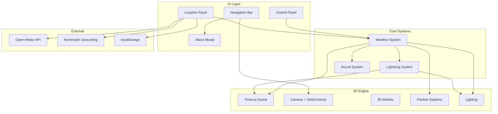

# Design Document

## Overview

The Eerie Weather App is a Three.js-based 3D weather visualization application featuring a floating haunted house that responds to various weather conditions. The application combines real-time weather data from the Open-Meteo API with manual controls, allowing users to experience immersive weather effects including rain, thunderstorms, snow, fog, and wind, each accompanied by ambient audio.

## Architecture



## Components and Interfaces

### Weather System

- **setWeather(weatherType, intensity)**: Main entry point for changing weather effects
- **clearAllWeather()**: Removes all active weather particles and resets scene
- **enableClear/Cloudy/Rain/Snow/Fog/Windy(intensity)**: Individual weather effect functions

### Lightning System

- **createLightningBolt(startX, startY, startZ, endX, endY, endZ)**: Generates jagged line geometry
- **createLightningStrike(intensity)**: Creates main bolt with branches and triggers flash
- **lightningState**: Tracks active flash for fade animation

### Sound System

- **playWeatherSound(weatherType, intensity)**: Plays looping audio for weather type
- **stopAllSounds()**: Pauses all weather audio
- **weatherSounds**: Map of Audio objects for each weather type

### UI Components

- **Control Panel**: Weather type dropdown, intensity slider, audio indicator
- **Location Panel**: City search with autocomplete, weather info display, favorites
- **Navigation Bar**: Home button (camera reset), About button (modal toggle)

## Data Models

### Weather State

```javascript
{
  currentWeather: string,      // "clear" | "cloudy" | "rain" | "thunderstorm" | "snow" | "fog" | "windy"
  weatherIntensity: number,    // 0-100
  manualOverride: boolean      // true when user manually changes weather
}
```

### Lightning State

```javascript
{
  active: boolean,
  fadeStart: number,           // timestamp
  duration: number,            // milliseconds
  flashIntensity: number,
  ambientIntensity: number
}
```

### City Weather Data

```javascript
{
  city: string,
  condition: string,
  raw: {
    current: {
      temperature_2m: number,
      relative_humidity_2m: number,
      wind_speed_10m: number,
      weather_code: number
    }
  }
}
```

## Correctness Properties

_A property is a characteristic or behavior that should hold true across all valid executions of a system-essentially, a formal statement about what the system should do. Properties serve as the bridge between human-readable specifications and machine-verifiable correctness guarantees._

### Property 1: Weather effect exclusivity

_For any_ weather type selection, only one weather effect should be active at a time - selecting a new weather type should clear all previous weather particles and effects.
**Validates: Requirements 2.1, 2.2, 2.3, 2.4, 2.5, 2.6**

### Property 2: Sound-weather correspondence

_For any_ weather type with associated audio (rain, thunderstorm, windy, snow, fog), activating that weather should result in the corresponding sound playing.
**Validates: Requirements 4.1, 4.2, 4.3, 4.4, 4.5**

### Property 3: Sound exclusivity

_For any_ weather change, at most one weather sound should be playing at any time.
**Validates: Requirements 4.6, 4.7**

### Property 4: Lightning bolt validity

_For any_ lightning bolt creation with valid coordinates, the resulting geometry should contain multiple points forming a path from start to end position.
**Validates: Requirements 3.2**

### Property 5: Lightning branch scaling

_For any_ lightning strike, the number of branch bolts should increase proportionally with intensity.
**Validates: Requirements 3.3**

### Property 6: Intensity affects particle count

_For any_ weather type with particles (rain, snow, fog, wind), higher intensity values should result in more particles being generated.
**Validates: Requirements 2.3, 2.4, 2.5, 2.6, 3.1**

### Property 7: Manual override persistence

_For any_ manual weather change by the user, the manualOverride flag should be set to true, preventing API weather from automatically changing the effect.
**Validates: Requirements 6.5**

### Property 8: Audio indicator synchronization

_For any_ weather sound that plays, the audio indicator should display the corresponding filename.
**Validates: Requirements 5.3**

## Error Handling

- **Audio Autoplay**: Browser autoplay policies are handled by queuing sounds until user interaction
- **Invalid Coordinates**: Lightning bolt creation validates inputs to prevent NaN geometry errors
- **API Failures**: Network errors display user-friendly alerts and don't crash the application
- **Missing City**: Geocoding failures show alert with the searched city name
- **Missing Sound Files**: Sound play errors are silently caught to prevent console spam

## Testing Strategy

### Unit Testing

- Test weather state transitions
- Test lightning bolt geometry generation
- Test weather-to-sound mapping
- Test intensity calculations from API data

### Property-Based Testing

Using a property-based testing library (e.g., fast-check for JavaScript):

- Property tests should run minimum 100 iterations
- Each test should be tagged with the correctness property it validates
- Format: **Feature: eerie-weather-app, Property {number}: {property_text}**

### Integration Testing

- Test weather API response handling
- Test localStorage persistence for favorites
- Test UI state synchronization with weather system
